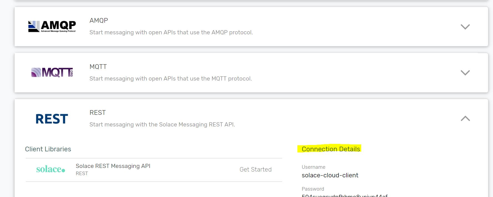

# JMS Samples using Alibaba Cloud's Natural Language Processing (NLP) SDK: Machine Translation (a.k.a Aliyun MT)

__Table of Contents__
* [What does this demonstrate?](#what-does-this-demonstrate)
* [Repository Contents](#repository-contents)
* [Checking Out](#checking-out)
* [Running the Samples](#running-the-samples)
  * Pre-requisites
  * Step 1: Enter your JMS broker's connectivity details in the JNDI file
  * Step 2: Enter your Machine Translation service's connectivity details in the properties file
  * Step 3: Start the replier program
  * Step 4: Start the responder program
  * Step 5: Get translating!
* [Advanced Steps](#advanced-steps)
  * [Running against alternative JMS Providers](#running-against-alternative-jms-providers) 
  * [How to submit HTTP Requests to the JMS Application Receiver](#how-to-submit-http-requests-to-the-jms-application-receiver)
  * [How to submit MQTT Requests to the JMS Application Receiver](#how-to-submit-mqtt-requests-to-the-jms-application-receiver)


## What does this demonstrate?

There are two applications coded to the JMS API in a Requestor and Replier role, respectively. (i.e. Implementing the [request-reply](https://www.enterpriseintegrationpatterns.com/patterns/messaging/RequestReplyJmsExample.html) enterprise integration pattern.)

The JMS code has been kept completely provider agnostic to demonstrate how one might switch JMS providers without needing application code change. The programs lean heavily on a [file-based JNDI](https://en.wikipedia.org/wiki/Java_Naming_and_Directory_Interface) to look up aspects such as the provider connection factory and JMS destinations to send and receive from. The program code therefore remains shielded from any provider specific implementation details - such as how destinations may be named and delimited.

Finally, the request-reply interaction is around the translation of English-language text to Chinese, leveraging the [Machine Translation](https://www.alibabacloud.com/products/machine-translation) SDK from Alibaba Cloud / Aliyun. 

The requestor program collects user input from the console and submits each line for translation as a JMS request message. The replier program receives the JMS request message, calls the Machine Translation API to translate the text payload to Chinese, and responds with the result as a new JMS reply message. The requestor program outputs to screen the Chinese-language translation.

## Repository Contents

This repository contains:

1. **AlibabaNLPRequestor.jar**: A runnable JAR of the requesting program, collects user input and submits for translation to Chinese.
2. **AlibabaNLPReplier.jar**: A runnable JAR of the replying program, receives English text and replies with Chinese translation.
3. Source code for the two programs as a Gradle project
4. Sample JNDI and properties files to connect to a JMS broker and connect to the Machine Translation SDK

## Checking out

To check out the project, clone this GitHub repository:

```
git clone https://github.com/itsJamilAhmed/jms-sample-alibaba-nlp
cd jms-sample-alibaba-nlp/
```

## Running the Samples

### Pre-requisites:

1. Get access to connection details for a running JMS broker supporting AMQP. 

You may wish to download and run ActiveMQ locally following instructions [here](https://activemq.apache.org/getting-started).
Alternatively you could access a free hosted JMS broker instance via [Solace Cloud](https://solace.com/cloud/). 

2. Activate the Machine Translation service in your Alibaba Cloud / Aliyun subscription and collect the AccessID and Access-Secret information as described [here](https://www.alibabacloud.com/help/doc-detail/96384.htm). 

If you want to just test the JMS connectivity, the replier program can be run in an offline "simulation" mode. Details on this available further below.

### Step 1: Enter your JMS broker's connectivity details in the JNDI file:

The project currently uses the [Apache Qpid JMS client](https://qpid.apache.org/components/jms/index.html). This implements the [AMQP1.0](https://en.wikipedia.org/wiki/Advanced_Message_Queuing_Protocol) open standard wire-line protocol - which has the advantage of being able to connect to any AMQP1.0 supported JMS broker.
[ActiveMQ](https://activemq.apache.org/) or [Solace PubSub+](https://solace.com/) both support the AMQP1.0 protocol so you can get the connection details for one of those.

Update the file [jndi.properties](jndi.properties) for the connection factory line to add details such as your AMQP URI hostname and port, username and password to connect to the JMS broker:

```
connectionfactory.ConnectionFactory = amqp://HOSTNAME-HERE:5672?jms.username=USERNAME-HERE&jms.password=PASSWORD-HERE&jms.clientIDPrefix=NLPTranslationSample-&
```


### Step 2: Enter your Machine Translation service's connectivity details in the properties file:

Once you have the access key and access secret on how to connect to your Machine Translation subscription, enter the details into the [alibaba-mt.properties](alibaba-mt.properties) file like so:

```
service-region=cn-hangzhou
access-key-id=IDGoesHere
access-key-secret=SecretGoesHere
```

_(Currently, the service is only available from a single region of "cn-hangzhou" so that detail is already filled in.)_

If you do not have access to the service yet and want to test the programs, the following property will run it in an offline simulation mode where JMS messages are passed between the applications, just the translation result is a placeholder:

```
# Optional parameter to start the Machine Translation functionality in a offline/simulation mode:
simulation-mode=true
```

### Step 3: Start the replier program

The replier program can be started first. It takes two arguments: the path to the JNDI file and the path to the MT service properties file. At the root of the checked out project:

```
java -jar AlibabaNLPReplier.jar -j ./jndi.properties -a ./alibaba-mt.properties
```

### Step 4: Start the requestor program

In another terminal start the requestor program. It just takes one argument: the path to the JNDI file for the JMS details:

```
java -jar AlibabaNLPRequestor.jar -j ./jndi.properties
```

### Step 5: Get translating!

In the requestor program enter text at the prompt and each new will result in a request being sent for translation. The next line response will show you the result.

Example output from requestor program:


Example output from replier program:


## Advanced Steps

### Running against alternative JMS Providers 

While the gradle project currently runs with the Qpid JMS Client and that is flexible enough to connect to multiple JMS providers, this project can very easily be updated to connect using other clients such as [ActiveMQ JMS Client](https://mvnrepository.com/artifact/org.apache.activemq/activemq-client) or [Solace PubSub+ native-protocol Client](https://mvnrepository.com/artifact/com.solacesystems/sol-jms).

The [build.gradle](build.gradle) file has placeholders in the "JMS Providers" section shown below.
To run the programs with another provider, comment the Qpid client entry and add the alternative provider's client.

```
	// JMS Provider's:
		// Apache Qpid JMS Client (connect to any AMQP1.0 supporting broker)
		compile group: 'org.apache.qpid', name: 'qpid-jms-client', version: '0.44.0'
		
		// Alternative Provider: ActiveMQ JMS Client
		//compile group: 'org.apache.activemq', name: 'activemq-client', version: '5.15.9'
		
		// Alternative Provider: Solace PubSub+ JMS Client
		//compile group: 'com.solacesystems', name: 'sol-jms', version: '10.6.3'
		
		// Alternative Provider: RabbitMQ JMS Client
		//compile group: 'com.rabbitmq.jms', name: 'rabbitmq-jms', version: '1.12.0'

```

The alternative JMS providers also have differences in the required contents for the JNDI properties file.
Example files have been included in the project on how to connect successfully to those alternatives.

- [solacepubsub-jndi.properties](solacepubsub-jndi.properties)
- [activemq-jndi.properties](activemq-jndi.properties)

### How to submit HTTP Requests to the JMS Application Receiver

You may have an environment where your applications using JMS need to communicate with newly developed services that do not use JMS, but say support HTTP interactions only.
One advantage of selecting [Solace PubSub+ Event Broker](https://www.solace.dev/) as a JMS provider is the in-built [REST Microgateway feature](https://docs.solace.com/Overviews/Microgateway-Concepts/Microgateways-Overview.htm).

The steps below will demonstrate how a HTTP POST via the curl tool can send the request to the same JMS receiver, for the response to seamlessly arrive as a HTTP response to the original POST. 

(Both programs will connect to a Solace PubSub+ JMS provider, which can still use the Qpid JMS API since Solace PubSub+ is also supporting the necessary AMQP1.0 protocol.)

#### Step 1: Adjust the topic destination of the existing programs

You will recall that the JNDI lookup label for the Requestor and Replier programs were already different/decoupled from each other. (i.e. They do not look up the same label from the JNDI.) This decoupling will be helpful now for this new requirement.

The Microgateway feature maps the URI of the REST Endpoint to the messaging topic names like so:
```
http://yourdomain:9000/path/goes/here	-> 	<REST-OPERATION>/path/goes/here	
```
So if your were doing a `POST` operation to `http://yourdomain:9000/path/goes/here` the resulting topic would be `POST/path/goes/here` for the applications that are connecting with messaging APIs like JMS.

To incorporate this additional level to the topic structure, lets update the [jndi.properties](jndi.properties) file like so:

```
topic.nlp-translation-requests-send = jms/nlp/translation/requests
topic.nlp-translation-requests-receive = */nlp/translation/requests
```

In short, the Requestor program will publish request messages to a topic beginning with `jms`, which can serve to signal that it is a JMS publisher.
The Replier program will subscribe to request messages from a new `wildcard topic` where it will accept requests that originate from `jms` senders as well as the HTTP clients through operations such as `POST`.

(It is assumed the ConnectionFactory is already connecting via the AMQP protocol to your Solace PubSub+ JMS broker.)

Re-launch the programs with these changes in effect.

#### Step 2: Switch the REST service into 'Gateway' mode

The Solace PubSub+ REST connectivity feature can operate in two modes: `messaging` and `gateway`. The default setting for a newly created broker or cloud service is `messaging` but we need it operating in 'gateway' mode for this exercise.

Follow the instructions [here](https://docs.solace.com/Configuring-and-Managing/Microgateway-Tasks/Managing-Microgateway.htm#Configure_VPN_Mode) to change the mode for your broker.

#### Step 3: Setup curl for the POST operation

For the same Solace PubSub+ broker, fetch the connectivity details for the REST protocol: `client-username`, `password` and `REST Host`.
If you are using an instance in [Solace Cloud](https://solace.com/cloud/), an example of where to find this is below:



For convenience, lets add those details to shell variables like so:

```
$ USER=solace-cloud-client
$ PASS=your-password-here
$ REST_ENDPOINT="http://your-instance-here.messaging.solace.cloud:9000/nlp/translation/requests"
```

When the JMS programs receive requests and respond to them, they expect a `CorrelationID` to be present to properly respond to the requests. For the HTTP POST we can pass this in the header, so let's setup a variable for this too:

```
$ CORRELATION="Solace-Correlation-ID: aRandomString"
```

Lastly, another header is required to specify that this is plain text being sent, and not say binary. This final shell variable can set this up too:

```
$ TYPE="Content-Type: text/plain"
```

The combined curl command now executes like so:

```
$ curl -u $USER:$PASS -d "This request is via HTTP POST" -H "$TYPE" -H "$CORRELATION" -X POST $REST_ENDPOINT
```

Here is an example response with it all put together:


On the Replier logs you can see messages being handled from both the JMS and HTTP sources like so:


### How to submit MQTT Requests to the JMS Application Receiver

[MQTT](http://mqtt.org/) is a lightweight, standard protocol that is well suited for ["Internet of Things (IoT)"](https://en.wikipedia.org/wiki/Internet_of_things) connectivity for devices.
You will typically have the situation that these IoT devices are supported by application services that are running in a data-centre or cloud for data processing or feature delivery. Those existing application services may already be communicating amongst themselves using a JMS provider so bridging these new MQTT protocol messages for seamless delivery to those JMS receivers can be a huge advantage. 

As was described in the earlier '[How to submit HTTP...](#how-to-submit-http-requests-to-the-jms-application-receiver)' above, selecting [Solace PubSub+ Event Broker](https://www.solace.dev/) as your JMS Provider has these added advantages of native protocol-translation without needing to deploy additional products in your environment.

The below example will demonstrate how a message sent via the MQTT protocol over WebSockets can arrive at the same JMS receiver for further processing.

**Note:** As this 'How to' is a continuation of the earlier one for HTTP, it is assumed you have completed 'Step 1' and 'Step 2' from [here](#how-to-submit-http-requests-to-the-jms-application-receiver). 

#### Step 1: Selection of the MQTT Publisher

As MQTT is a standard connectivity protocol, any MQTT client API can publish to the Solace PubSub+ broker. (i.e. There is no API required to be fetched from Solace.) Therefore we can use the online hosted JavaScript-over-WebSockets MQTT utility by Eclipse Paho for this demonstration. That is available here: https://www.eclipse.org/paho/clients/js/utility/

#### Step 2: Enter the connectivity details for your Solace PubSub+ Broker

Copy in the connectivity details into the online client like so:


#### Step 3: Enter the topic and message for sending

This request can be sent to the MQTT specific topic of `mqtt/nlp/translation/requests` like so:


#### Step 4: Review Replier program console or log output

You will recall that our JMS programs are utilising a 'request-reply' pattern of message exchange, with a 'reply-to' topic being essential to see the translation response. As this hosted MQTT client is not carrying out all these necessary steps tbe request will not be properly dealt with. However evidence of the message arrival and processing of the content can be seen in the logs as follows:


While the lightweight MQTT protocol does not explicitely define a request-reply mechanism, it can very easily be simulated using custom defined topics and headers. For further information on how you may build your own MQTT sender to properly implement the request-reply pattern to successfully get a translation response back to the MQTT sender, read the following guide: [Solace MQTT Samples - Rquest/Reply](https://solace.com/samples/solace-samples-mqtt/request-reply/)


